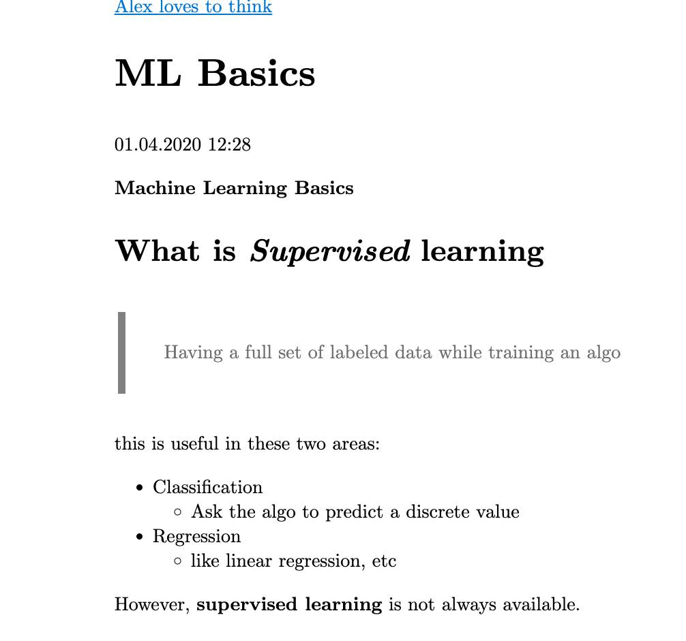

# LaTeX Paper Hugo Theme

LaTeX Paper — a [Hugo](https://gohugo.io/) theme for LaTeX style lovers.

This Project is highly inspired by one of the [Typora theme](https://theme.typora.io/theme/paper/).

**We are just starting! Come and join us!**

Here is the showcase




## Installation

In your Hugo site `themes` directory, run:

```bash
git clone https://github.com/chang2000/hugo-theme-latex-paper latex
```

Next, open `config.toml` in the base of the Hugo site and ensure the theme option is set to `blank`.

```
theme = "latex"
```

For more information read the official [quick start guide](https://gohugo.io/getting-started/quick-start/) of Hugo.

## Contributing

Have you found a bug or got an idea for a new feature? Feel free to use the [issue tracker](https://github.com/Vimux/blank/issues) to let me know. Or make directly a [pull request](https://github.com/Vimux/blank/pulls).

## License

This theme is released under the [MIT license](https://github.com/Vimux/blank/blob/master/LICENSE).
